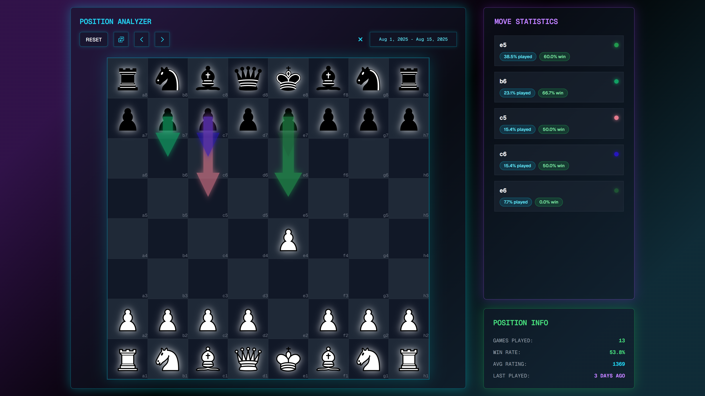

<p align="center">
</img>
</p>

This application is greatly inspired by the [OpeningTree](https://www.openingtree.com/). The main difference is that the games are pre-processed and stored on the server side. You can test the demo application using [this link](https://neochess.onrender.com/) (the first request will be delayed for a while due to the server spinning up).



# Features

- The user is able to choose platform (for now it's just [Chess.com](https://www.chess.com/)) and load the games for a specific user.
- Unlike OpeningTree, Neochess downloads the games directly into its database for better UX: users don't have to wait for the games to load every time they enter the app. This also makes it possible to analyze a bigger amount of games, compared to OpeningTree.
- The user is able to make moves on the virtual board. The behaviour and UX features of the board were mostly inspired by the behaviour of the board in Chess.com.
- Each move triggers request to the server asking for move statistics for each given position. The statistics of each of the moves played in the given position in displayed for the user to analyze.
- Request coalescing: if games are being loaded for one of the users, duplicate requests won't trigger the same logic, but rather will be redirected to the shared progress stream of the previously started process.

# Tech stack

## Backend

The backend is written in rust and uses [Actix](https://github.com/actix/actix-web) framework to handle requests and pass them to [Juniper](https://github.com/graphql-rust/juniper). The server is implemented according to the rules of hexagonal architecture (the structure and main architectural decisions were inspired by [this article](https://www.howtocodeit.com/articles/master-hexagonal-architecture-rust)).

## Frontend

The frontend is written in React and uses [Chakra UI](https://github.com/chakra-ui/chakra-ui) as a main UI instrument. [React Router](https://github.com/remix-run/react-router) navigates the users between 2 main pages. [Zustand](https://github.com/pmndrs/zustand) is used for state management due to its simplicity and convenience of usage compared to redux. To communicate over the GraphQL interface [Apollo Client](https://github.com/apollographql/apollo-client) is used.

# Possible improvements

1. Implement the right mouse click behaviour from Chess.com
2. Allow users uanalyze positions while their games are being loaded

# Running locally

Here's how to spin up a local instance of Neochess in docker on your machine:

## Dev mode

In dev build hot reloading works for both frontend and backend.

```bash
docker compose build && docker compose up --watch
```

## Release mode

To run the app in release mode you will need to update the `.env` file:

```diff
# Mode (debug or release)
- MODE=debug
+ MODE=release
```

Then run the container:

```bash
docker compose up --build
```
